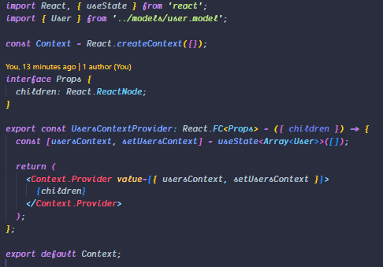
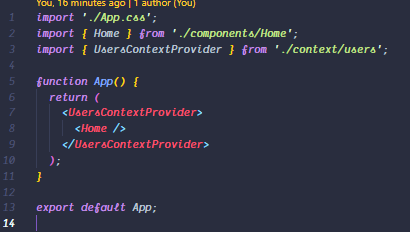
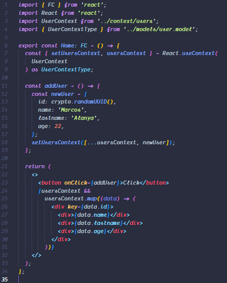

<h1 align="center">Welcome to context-tsx 👋</h1>
<p>
  
</p>

> Ejemplo de como usar Context en React con typescript

## Install

```sh
yarn install
```

## Context

En el siguiente ejemplo se puede visualizar la creacion del contexto


## Global

Se puede visualizar que se coloca en un contexto global


## Use

Y por ultimo se puede visualizar su uso

